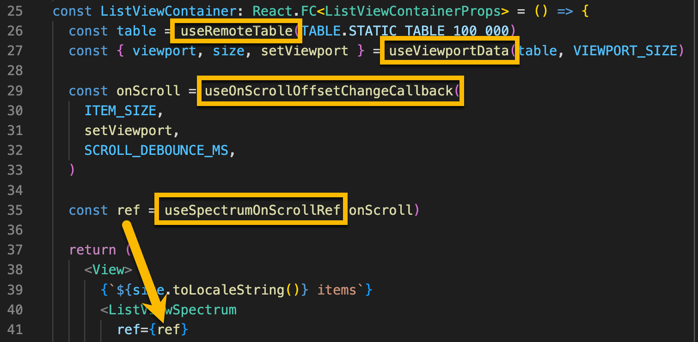

# Spectrum Spike Synopsis

## React Spectrum Architecture

[React Spectrum](https://react-spectrum.adobe.com/index.html) consists of 3 primary libraries

- React Aria - accessibility (see [React Aria for Accessibility](#react-aria-for-accessibility) in this doc)
- React Stately - state management
- React Spectrum - design system implementation on top of the other 2 libraries with theming support

The official docs have a good overview of the [architecture design](https://react-spectrum.adobe.com/architecture.html).

## Virtualization

React Spectrum supports list virtualization out of the box, but it uses an "infinite scrolling" paradigm instead of a "windowing" one that we use in DH. It basically supports "scroll and give me next chunk of data, scroll again give me more, etc.". The concept of picking an arbitrary range of items in the list is not directly supported, and the scrollable area grows as items are added instead of being calculated based on the total size of the data source.

## Windowing

To support windowing, I investigated 2 approaches.

### 1. Modify `React Spectrum` libraries to support windowing

### Details

- There is a shared `Virtualizer` component (`packages/@react-aria/virtualizer/src/Virtualizer.tsx`) responsible for virualization
- There is also a custom `TableVirtualizer` used for the TableView component
- Existing implementation seems to assume that the given `items` collection contains all items. There is no concept of a "total count" that differs from the actual number of items in the list
- The scrollable area is only as large as the known number of items. This means we can't scroll to the end of a large list and let the scroll position drive the data window to be loaded
- There are multiple components that use the Virtualizer (ListView, TableView, ListBox, Picker to name a few)

### Conclusion

Adding support to `React Spectrum` for windowing seems to be a fundamental paradigm change to the current implementation. It may be possible, but it would likely require changes to the Virtualizer, TableVirtualizer + changes to multiple complex components. While we could certainly try this, I believe the amount of development + testing involved + the required back and forth with Adobe for approval is probably more expensive than justified at this point.

### 2. Manage Windowing outside of React Spectrum

#### Details

- I used the the `useListData` hook from `react-stately` to provide data to ListView, ListBox, TableView, and Picker components
- Using the total count, the initial data list is populated with stub objects for the full number of items. Item keys are simply sequential numeric strings ('0', '1', '2', ... N-1)
- A scroll handler is attached to appropriate DOM refs for Spectrum component containers. On scroll, the data window is calculated, and new viewport data is loaded from dh table
- Extracting DOM elements from Spectrum components can be done by calling `UNSAFE_getDOMNode()` on a ref to the component. Getting the scrollable area for Picker is a little more complex since it only shows up temporarily in a portal. Getting the scrollable area for the TableView also requires a little extra work since it has a header + a body
- Custom React hooks for viewport management, scroll handlers, ref extraction, etc. can be composed making things easier to wire up
  
- For most components, 100K items can be scrolled performantly. The `TableView` is the exception which can sometimes take a 1-2 seconds to re-render after scrolling to an unloaded window

#### TODO

- Sorting has not been implemented
- Item keys are currently just sequential numeric strings based on order in the items array. TBD whether this imposes any limitations
- Items that haven't loaded yet currently show with `...` until they are loaded. We may want to use a prettier loading indicator if possible

### Conclusion

This approach seems viable enough to try using React Spectrum in DH

## React Aria for Accessibility

`React Aria` makes it possible to create our own custom components without having to implement accessibility. Hooks in this library provide props that can be spread on elements to attach accessibility behavior. Such components would not benefit from the theming support provided by `React Spectrum`, but it is a good accelerator if we find we have to write any components from scratch.

See [CustomListBox.tsx](src/components/CustomListBox/CustomListBox.tsx) as an example of attaching accessibility props to a custom component.
